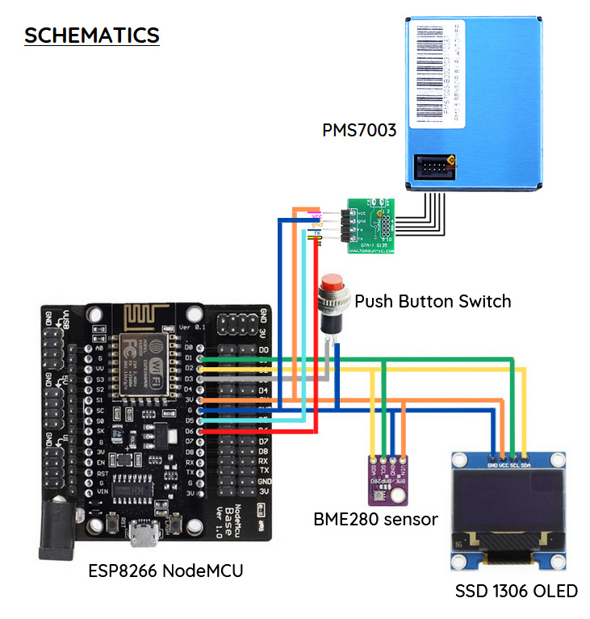
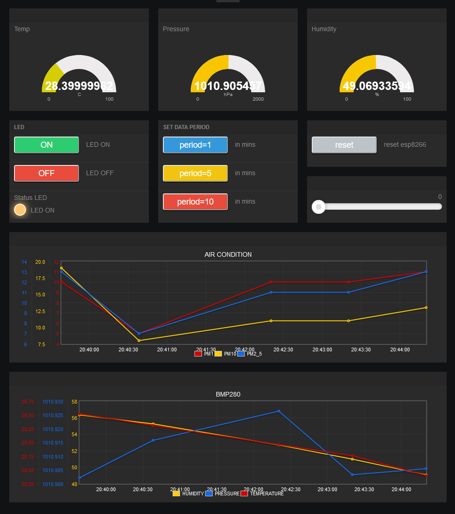
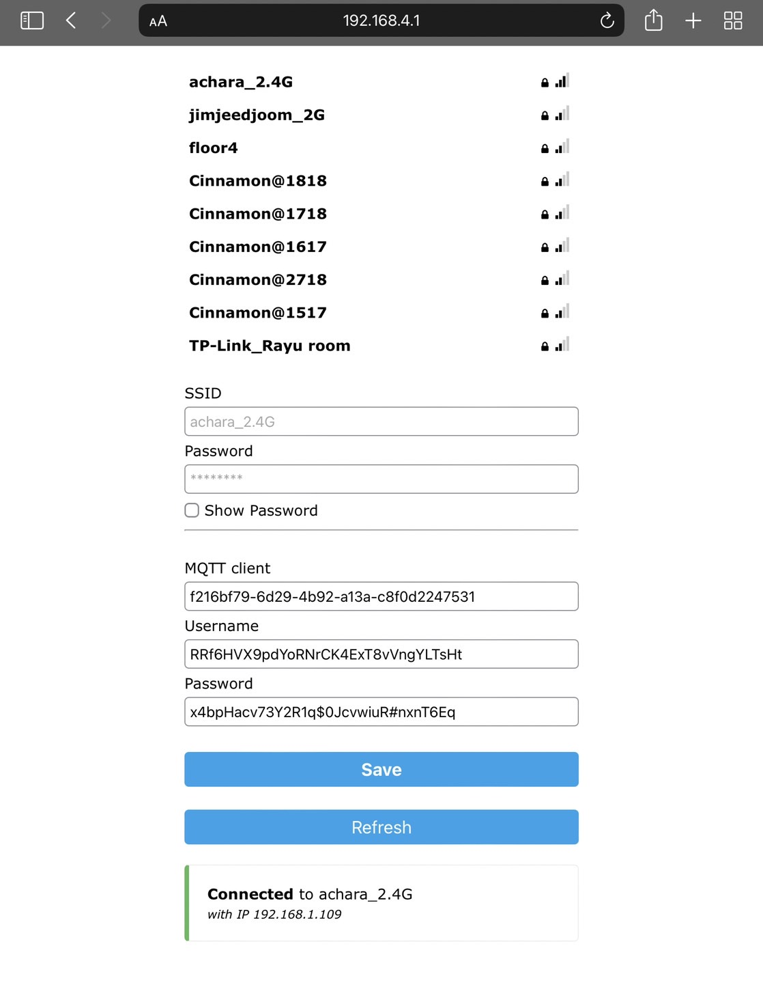
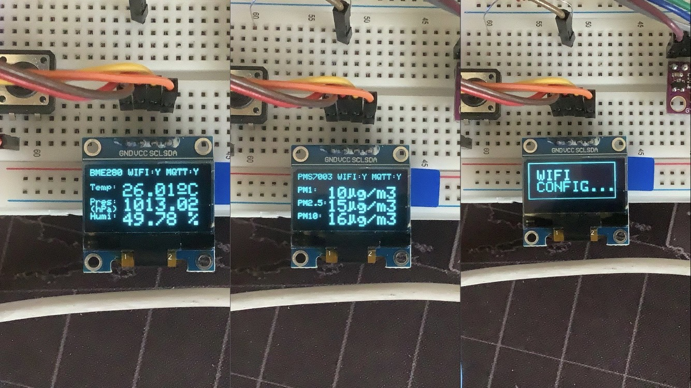

# IOT_project_Overview
<b>Pongsathorn Utsahawattanasuk 6210554784</b>
 Electrical Engineering student, Kasetsart University

## Project Requirements
1. It must display some variables for monitoring (humidity, temperature, pressure, velocity, distance etc.)
2. It should be able to control some hardware (use a slider, button, toggle to adjust some parameter or change system state, etc.)
3. It must compute something, ranging from some simple formula  to more complex algorithm such as FFT, PID, digital signal processing. Score is expected to depend on how challenging is your development.
4. The more advanced your IoT uses MCU resources (timer, processor cores) and coding techniques (ex. multitasking) , the more likely you'd score better on the project.

## Project Description
1. Monitoring Temperature, Humidity, Pressure, PM1, PM2.5, and PM10
2. Use Netpie IOT cloud platform, Netpie freeboard
3. Commands for EEPROM, Wi-fi, MQTT, OLED
4. Multitsaking with FreeRTOS on esp32
5. Create pms7003 header,cpp for esp8266
6. Turn on/off BUILTIN_LED and reset esp8266 from netpie freeboard
7. Able to set the send data period through netpie freeboard

## Hardware & Sodtware
### Hardware
1. NodeMCU esp8266
2. bme280, pms7003 sensors
3. button, wires, resistor
4. OLED(ssd1306)
5. NodeMCU esp32 Note: I upgraded my project with esp32 for Multitsaking with FreeRtos 

### Software
1. [Arduino IDE link](https://www.arduino.cc/en/software)
2. [Netpie2020 link](https://netpie.io/)

## Features

### Schematics

### Freeboard

## Serial Command lists
1. client=       # Specify Client ID String from Netpie2020        
2. username=     # Specify Client username String from Netpie2020  
3. password=     # Specify Client password String from Netpie2020  
4. saveConfig          # Save the data to EEPROM                         

## Wifi Portal (hold FLASH button for 5 seconds)

 after you click save button the data will be save. the board will connect to Wi-fi automatically everytime the board start. the wifi credential need to set through this portal but for mqtt is optional becasue i create the command to set mqtt through serial port.

## OLED

1. oled will turn off every 1 min
2. push the button to turn it on again
3. push the button will change the mode of oled
4. push the button more than 5 second will turn on Wi-Fi portal
