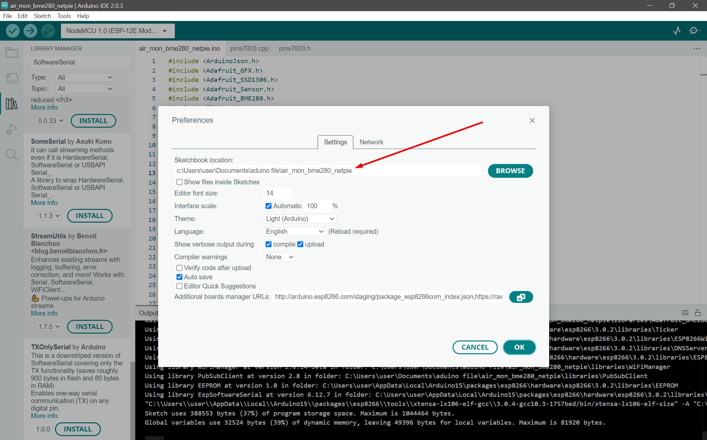
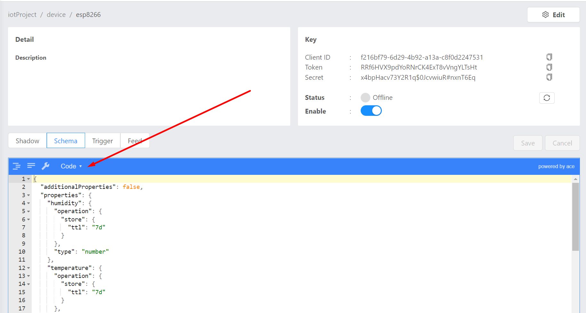

# For esp8266

## After download the code

 if you want to use the same version as my libraries, you need to specify the preference as the folders that your download.Also unzip the libraries folder

## Store sata on netpie by adding jason schema

 copy the file in schema.txt and then click on schema in netpie and select code then add the schema in it.

## Using freeboard
